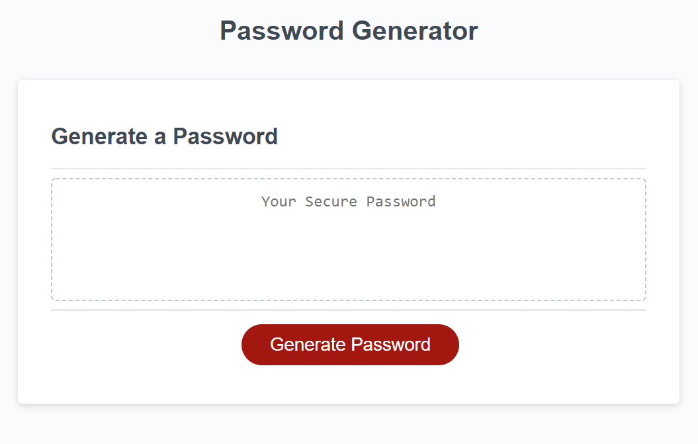

# Password Generator

# <Password-Generator>

## Description

Employees with sensitive data to protect would like to be able to generate strong passwords that fit password criteria. I have created a password generate that will ask the user which criteria they would like their password to fit and then randomly generate a password that matches the criteria. It then displays the password to the page where it can easily be copied for use elsewhere.

## Usage

Visit the finished product here: https://tessshearer.github.io/Password-Generator/

## Credits

I created and finished this project on my own.# Password Generator Starter Code
